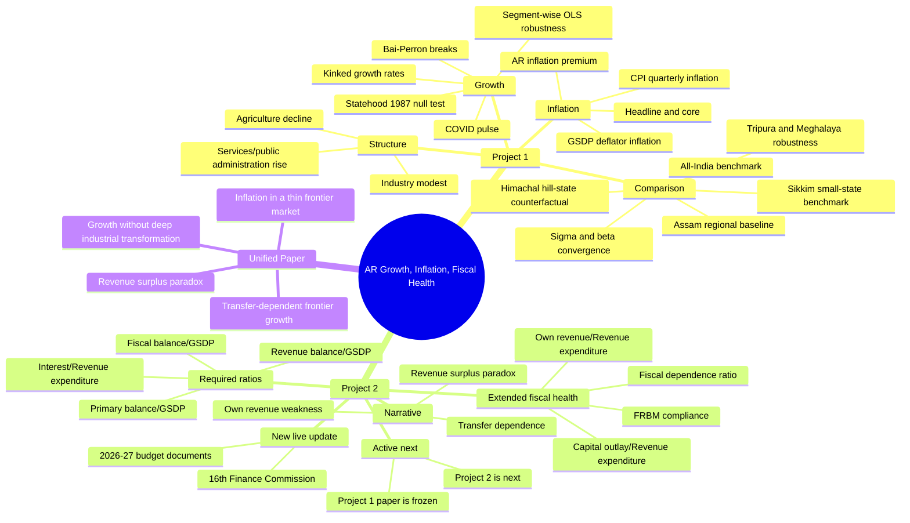

# Project Memory and Mind Map

## Source of Truth

- Main executable notebook: `full_analysis.ipynb`
- Findings draft: `RESEARCH_FINDINGS.md`
- Final Project 1 paper source: `Project1_Final_Paper/Project1_Final_Paper.tex`
- Final Project 1 paper PDFs: `Project1_Final_Paper/Project1_Final_Paper.pdf` and `Project1_Final_Paper/S.M. Muzammil Afroz.pdf`
- Data folder: `Data/`
- Output folders: `tables/`, `figures/`

Key new Project 1 data sources added on 2026-04-26:

- `Data/GSDP_NSDP_India_1960_2025_BackSeries.xlsx`: long-run all-state GSDP, NSDP, population, and per-capita backseries.
- `Data/CPIndex_Jan11-To-Dec25_statewise_allgroup_merged.csv`: all-state CPI group indices.
- `Data/CPI_State_Weights_India.csv`: state CPI rural/urban weights; useful for documentation, but not exact combined-sector core CPI.
- `Data/ALL STATES FINANCE DATABASE.XLSX`: all-state fiscal heads, 1990-91 to 2025-26; it does not contain SDP/GSDP denominators.

## Assignment Split

Project 1 asks for:

- All-India GDP and Arunachal Pradesh GSDP trend growth with structural breaks.
- Quarterly inflation for India and Arunachal Pradesh using CPI and GDP/GSDP deflator.
- Annual headline and core inflation for 2011-12 to 2023-24.

Project 2 asks for:

- Revenue deficit/surplus as percent of GSDP.
- Fiscal deficit/surplus as percent of GSDP.
- Primary deficit/surplus as percent of GSDP.
- Interest expenditure as percent of revenue expenditure.
- Interpretation of fiscal health and relationship with state growth.

## What Is Good Now

- `full_analysis.ipynb` executes end-to-end with 0 code-cell errors using the R kernel.
- Tables and figures are regenerated from the notebook, not from sidecar `.R` scripts.
- The final Project 1 LaTeX paper has been updated, compiled, and synced to the student-named PDF.
- CPI month encoding is handled separately for India numeric months and AR text months.
- AR CPI uses rural only; urban is absent and combined is not reliable.
- Bai-Perron structural breaks are run for India and AR, with trimming sensitivity and bootstrap confidence intervals.
- Growth-rate reporting now has two clearly separated specifications: Baseline A is the Boyce continuous kinked model with HC1 delta-method regime-slope standard errors; Baseline B is segment-wise OLS/pure structural-change sensitivity with discontinuous level shifts and regime-specific HC1 standard errors. Do not call Baseline B the Boyce kinked model.
- The Project 1 paper now states this distinction correctly in the abstract, literature review, methodology, growth-results section, robustness section, and appendix figures.
- Project 2 table now includes 2025-26 with an explicit GSDP source note.
- Capital outlay now merges correctly into extended fiscal indicators.
- Project 1 now has a self-contained cross-state comparator module using the new all-state backseries and CPI data.
- New Project 1 comparator outputs are `tables/table13_data_coverage_audit.csv` through `tables/table17_comparator_cpi_inflation.csv`.
- New Project 1 figures are `figures/fig12_comparator_real_growth_paths.png` through `figures/fig15_cross_state_cpi_pressure.png`.
- New Baseline A/B growth artifacts are `tables/table2_regime_growth.csv`, `tables/table2b_segmentwise_growth.csv`, `tables/table2c_kinked_vs_segmentwise_growth.csv`, `figures/fig1b_india_segmentwise_vs_kinked_fit.png`, and `figures/fig4b_ar_segmentwise_vs_kinked_fit.png`.

## Current Status

- Project 1 is submission-ready in this workspace.
- The methodological position is settled: Boyce continuity restriction is the baseline; segment-wise OLS is a robustness/sensitivity specification.
- The next active task can move to Project 2 without reopening Project 1 unless the user wants stylistic edits only.

## Fixes Made on 2026-04-26

- Fixed workspace rule to point to `RESEARCH_AGENT_GUIDE_v2.md`, because v3 is not present.
- Fixed CPI weight verification to sum group weights only, instead of double-counting subitems and the general index.
- Fixed broad-sector column selection by exact column name, preventing `Services(Rs Lakh)` from being confused with detailed service columns.
- Fixed quarterly GSDP deflator fiscal-year labeling after Denton interpolation.
- Removed partial FY 2025-26 from annual CPI/core inflation outputs.
- Kept FY 2020-21 AR CPI/core values despite missing months, because dropping it breaks the year-on-year chain; interpret with caveat.
- Changed the COVID dummy to a one-year FY 2020-21 pulse rather than a permanent post-2020 dummy.
- Added `tables/table11_project2_fiscal_indicators.csv`.
- Added `tables/table12_extended_fiscal_indicators.csv`.
- Fixed the capital-outlay/interest figure so it actually shows both capital outlay and interest burden.
- Added `Step 28A -- Project 1 Comparative State Module` to `full_analysis.ipynb`.
- Added data coverage audit for AR, Assam, Sikkim, Himachal Pradesh, Tripura, Meghalaya, Mizoram, Nagaland, Manipur, and Uttarakhand.
- Added comparator growth regimes: pre-liberalisation baseline, 1991-2003, 2003-2013, and post-2013.
- Added comparator COVID shock metrics: pre-COVID trend, actual 2019-20 shock, shock relative to trend, recovery CAGR, and latest level relative to 2019.
- Added cross-state CPI pressure comparison for headline, food, and fuel inflation; exact state-level core CPI is intentionally not reported.
- Verified the notebook end-to-end after these changes: `notebook_execution_project1_comparison.log` reports 0 code-cell errors.

## Fixes Made on 2026-04-27

- Added Baseline B segment-wise OLS growth estimation to `full_analysis.ipynb`.
- Corrected Baseline A inference so regime slopes use HC1 delta-method standard errors rather than raw slope-change-term standard errors.
- Added Baseline A/B comparison outputs and comparison figures.
- Updated `RESEARCH_FINDINGS.md` to document the Boyce-versus-segment-wise distinction and the actual estimated differences.
- Updated `RESEARCH_AGENT_GUIDE_v2.md` so future work does not mislabel the discontinuous specification as Boyce.
- Updated `Project1_Final_Paper/Project1_Final_Paper.tex` and rebuilt both Project 1 PDFs with the corrected methodology and comparison table.

## Fixes Made on 2026-04-29

- Refreshed Project 2 state from memory, local outputs, and live budget sources.
- Corrected the 2026-27 official GSDP denominator in `Data/Project2_Budget_Documents/project2_budget_reference_values.csv` from `41341` to `41314`, matching the official Budget at a Glance 2026-27.
- Re-ran `full_analysis.ipynb`; Project 2 tables and figures were regenerated with no notebook error outputs.
- Recompiled `Project2_Final_Paper/Project2_Final_Paper.pdf` and synced `Project2_Final_Paper/S.M. Muzammil Afroz Project 2.pdf`.
- The correction slightly changes unrounded 2026-27 ratios but leaves rounded paper conclusions unchanged: revenue surplus remains about 8.9% of GSDP, official fiscal deficit about 1.7%, and broad PRS-style fiscal deficit about 11.0%.

## Remaining Caveats

- Figure 1 warns that India has observations before AR starts in 1980. That warning is harmless, but can be removed by plotting the two series from separate data frames.
- AR annual CPI for FY 2020-21 is partial because of COVID-period missing data. Keep the caveat visible.
- Sikkim has no pre-1991 constant-price GSDP sample; in comparator tables its pre-liberalisation baseline is marked unavailable.
- Manipur, Mizoram, Nagaland, and Sikkim have shorter or latest-year gaps in parts of the backseries; keep this visible when using them outside robustness/audit roles.
- All-state CPI has COVID-period missing months. The audit table records missing headline CPI months by state.
- Cross-state exact core CPI is not computed because the uploaded state weights combine food, beverages, and tobacco and do not provide exact combined-sector weights.
- Project 2 now uses a hybrid fiscal-source design: RBI State Finance Database as the backbone, plus official 2026-27 budget documents for the top-up and deficit-definition reconciliation.
- The official state-budget fiscal balance and the broader PRS-style deficit are not the same concept. Keep both visible and never mix them silently.
- The latest Project 2 paper is now in `Project2_Final_Paper/`, but it still depends on the current figures and tables in the shared workspace folders.

## Project 1 Novelty Options

Best low-overlap additions for Project 1:

- Statehood null-result: formally test whether 1987-88 is selected as a structural break. The current Bai-Perron result says no; that is novel because it challenges the obvious administrative-break story.
- Growth without transformation: use sectoral shares and public-administration/service detail to show whether growth is services-heavy rather than industry-led.
- CPI-deflator wedge: compare CPI inflation and GSDP deflator inflation to show how consumer price pressures differ from production-side price changes.
- Inflation premium and volatility: compare AR rural CPI inflation with all-India CPI; emphasize supply-chain and thin-market volatility rather than only average inflation.
- Convergence position: use all-state per capita NSDP to show whether AR is converging, diverging, or simply transfer-supported.
- Robustness package: trimming sensitivity, bootstrap confidence intervals, and alternative COVID dummy definitions.

Final Project 1 comparator design:

- Arunachal Pradesh: assigned frontier state.
- Assam: Northeast regional baseline.
- Sikkim: small Himalayan benchmark; use available sample from 1993-94 to 2023-24.
- Himachal Pradesh: hill-state counterfactual outside the Northeast.
- Tripura and Meghalaya: Northeast robustness comparators.

Current comparator findings from the notebook:

- AR's constant-price GSDP break years remain 1995 and 2013.
- AR pre-liberalisation CAGR is 9.34%, higher than its 1991-2003 CAGR of 5.18%, so the story is not a simple post-1991 acceleration.
- AR's 2019-20 COVID growth shock is -3.69%, which is milder than Meghalaya (-7.85%) but similar to Himachal Pradesh (-4.40%) and Tripura (-4.36%).
- AR's post-2020 recovery CAGR is 5.02%, below Assam, Sikkim, Tripura, and Meghalaya in the current comparator table.
- AR headline CPI pressure is high on average but its FY 2020-21 headline inflation shock is lower than Assam, Sikkim, Tripura, and Meghalaya; food and fuel should be discussed separately.

Best combined Project 1 plus Project 2 publishable angle:

- "Transfer-dependent frontier growth": AR looks fiscally healthy and grows reasonably fast, but both patterns are tied to central transfers, weak own revenue, and limited structural transformation.
- This contribution is not another descriptive state report; it is the paradox: high revenue surplus, low interest burden, high central dependence, and a services-heavy economy with rural-only inflation pressure.

## Project 2 Ready State

- The Project 2 notebook now regenerates a corrected five-year table for `2022-23` to `2026-27` in `tables/table11_project2_fiscal_indicators.csv`.
- The latest table uses the RBI database for 2022-23 and 2023-24, then official 2026-27 budget documents for 2024-25 actuals, 2025-26 revised estimates, and 2026-27 budget estimates.
- The fiscal-deficit section is now split into an official state-budget baseline and a broad PRS-style sensitivity check, stored in `tables/table20_project2_deficit_reconciliation.csv`.
- The extended fiscal outputs now include the 2026-27 official top-up, transfer snapshot, and committed-expenditure snapshot in `tables/table12_extended_fiscal_indicators.csv`, `tables/table22_project2_transfer_snapshot.csv`, and `tables/table21_project2_committed_expenditure_snapshot.csv`.
- New Project 2 figures are `fig17_project2_deficit_reconciliation.png` and `fig18_project2_revenue_composition.png`, alongside the refreshed `fig9`, `fig10`, and `fig11`.
- The standalone Project 2 paper workflow now exists in `Project2_Final_Paper/Project2_Final_Paper.tex` with compiled PDFs in the same folder.
- As of 2026-04-29, the final research-extended Project 2 paper also includes Route 1 own-tax buoyancy, Route 2 16th FC transfer-shock simulation, and Route 3 cross-state comparison.
- New extension outputs are `tables/table23_project2_tax_buoyancy_regression.csv`, `tables/table24_project2_16fc_simulation.csv`, `tables/table25_project2_cross_state_comparison.csv`, and `tables/table26_project2_extension_diagnostics.csv`.
- New extension figures are `fig19_project2_tax_buoyancy.png`, `fig20_project2_transfer_shock.png`, and `fig21_project2_cross_state_comparison.png`.
- Key nuance: the own-tax elasticity is high, about 1.69, so do not claim own tax is unresponsive to GSDP. The correct claim is that the own-tax base remains too small relative to transfer-financed expenditure needs.
- As of the final 2026-04-29 publishable-paper upgrade, Project 2 also includes a substantive literature review, ADF and Engle-Granger diagnostics, long-run core fiscal-indicator history, committed-expenditure trajectory, central-transfer composition, and an illustrative 16th FC 2026-31 transfer path.
- New upgrade outputs are `tables/table27_project2_buoyancy_time_series_tests.csv`, `tables/table28_project2_longrun_core_indicators.csv`, `tables/table29_project2_committed_expenditure_trajectory.csv`, `tables/table30_project2_transfer_breakdown.csv`, and `tables/table31_project2_16fc_transfer_trajectory.csv`.
- New upgrade figures are `fig22_project2_longrun_core_indicators.png`, `fig23_project2_committed_expenditure_trajectory.png`, `fig24_project2_transfer_breakdown.png`, and `fig25_project2_16fc_transfer_trajectory.png`.
- Updated econometric nuance: ADF tests reject unit roots in log own tax and log GSDP with deterministic trend, but the Engle-Granger test does not reject no cointegration at 5 percent (p about 0.098). The buoyancy coefficient should be written as descriptive, not as a settled causal long-run relationship.
- Updated paradox quantification: in 2022-23 to 2026-27, revenue balance averages 15.9 percent of GSDP, central transfers average 85.9 percent of revenue receipts, and own revenue finances only 18.2 percent of revenue expenditure.
- Final compiled outputs are `Project2_Final_Paper/Project2_Final_Paper.pdf` and `Project2_Final_Paper/S.M. Muzammil Afroz Project 2.pdf`.

## Next Research Path

- Treat the RBI State Finance Database as the permanent backbone for Project 2; only top up years beyond the RBI release window with official Arunachal budget documents.
- If extending the paper beyond the current final draft, the next high-value addition is a sector-priority appendix using `Demands for Grants 2026-27` and the `Budget Speech 2026-27`.
- A second optional extension is a CAG-style cross-check layer for state finances and finance accounts, but this is an enhancement rather than a blocker.
- Keep Project 2 standalone. If a combined research manuscript is prepared later, connect it through the shared thesis of transfer-dependent frontier growth rather than by duplicating tables across Project 1 and Project 2.

## Current External Context to Update Later

- Arunachal Budget 2026-27 documents are live on the official budget portal.
- Official Budget at a Glance 2026-27 reports GSDP of Rs 41,314 crore, projected receipts of Rs 36,607 crore, and fiscal deficit of Rs 701 crore, equal to 1.70% of GSDP.
- PRS Budget Analysis 2026-27 reports a revenue surplus of Rs 3,672 crore, 9% of GSDP, and notes that the high revenue surplus stems from significant central transfers relative to a low GSDP base.
- PRS Budget Analysis 2026-27 also reports the broader fiscal deficit at Rs 4,551 crore, 11.0% of GSDP, because it does not net out central capex loans the way the official state-budget presentation does.
- PRS summary of the 16th Finance Commission says the report was tabled on February 1, 2026 for 2026-27 to 2030-31; Arunachal Pradesh's devolution share falls from 1.76 under the 15th FC to 1.35 under the 16th FC.

Useful current links:

- Official Arunachal Budget portal: https://www.arunachalbudget.in/
- Official Annual Financial Statement 2026-27: https://arunachalbudget.in/docs/AFS-2026-27.pdf
- Official Budget at a Glance 2026-27: https://www.arunachalbudget.in/docs/glance.pdf
- PRS Arunachal Pradesh Budget Analysis 2026-27: https://prsindia.org/budgets/states/arunachal-pradesh-budget-analysis-2026-27
- PRS 16th Finance Commission summary: https://prsindia.org/policy/report-summaries/report-of-the-16th-finance-commission-for-2026-31

## Mind Map

