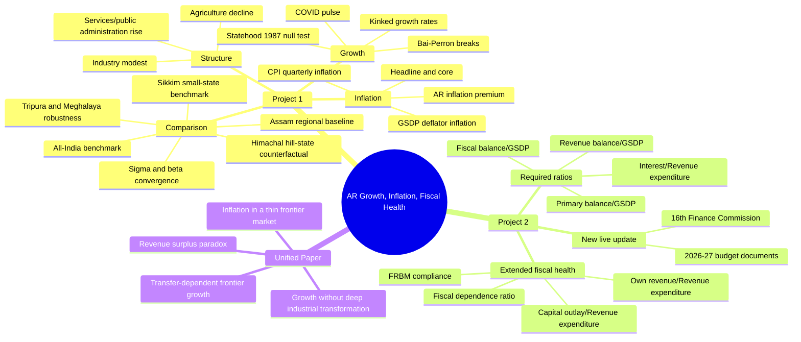

# Project Memory and Mind Map

## Source of Truth

- Main executable notebook: `full_analysis.ipynb`
- Main guide in this workspace: `RESEARCH_AGENT_GUIDE_v2.md`
- Findings draft: `RESEARCH_FINDINGS.md`
- Data folder: `Data/`
- Output folders: `tables/`, `figures/`
- Legacy/reference R scripts: `full_analysis.R`, `generate_outputs.R`

The notebook is now self-contained: it does not call `source()`, `full_analysis.R`, or `generate_outputs.R`. Keep the `.R` files only as historical reference until submission is frozen.

Key new Project 1 data sources added on 2026-04-26:

- `Data/GSDP_NSDP_India_1960_2025_BackSeries.xlsx`: long-run all-state GSDP, NSDP, population, and per-capita backseries.
- `Data/CPIndex_Jan11-To-Dec25_statewise_allgroup_merged.csv`: all-state CPI group indices.
- `Data/CPI_State_Weights_India.csv`: state CPI rural/urban weights; useful for documentation, but not exact combined-sector core CPI.
- `Data/ALL STATES FINANCE DATABASE.XLSX`: all-state fiscal heads, 1990-91 to 2025-26; it does not contain SDP/GSDP denominators.

## Assignment Split

Project 1 asks for:

- All-India GDP and Arunachal Pradesh GSDP trend growth with structural breaks.
- Quarterly inflation for India and Arunachal Pradesh using CPI and GDP/GSDP deflator.
- Annual headline and core inflation for 2011-12 to 2023-24.

Project 2 asks for:

- Revenue deficit/surplus as percent of GSDP.
- Fiscal deficit/surplus as percent of GSDP.
- Primary deficit/surplus as percent of GSDP.
- Interest expenditure as percent of revenue expenditure.
- Interpretation of fiscal health and relationship with state growth.

## What Is Good Now

- `full_analysis.ipynb` executes end-to-end with 0 code-cell errors using the R kernel.
- Tables and figures are regenerated from the notebook, not from sidecar `.R` scripts.
- CPI month encoding is handled separately for India numeric months and AR text months.
- AR CPI uses rural only; urban is absent and combined is not reliable.
- Bai-Perron structural breaks are run for India and AR, with trimming sensitivity and bootstrap confidence intervals.
- Project 2 table now includes 2025-26 with an explicit GSDP source note.
- Capital outlay now merges correctly into extended fiscal indicators.
- Project 1 now has a self-contained cross-state comparator module using the new all-state backseries and CPI data.
- New Project 1 comparator outputs are `tables/table13_data_coverage_audit.csv` through `tables/table17_comparator_cpi_inflation.csv`.
- New Project 1 figures are `figures/fig12_comparator_real_growth_paths.png` through `figures/fig15_cross_state_cpi_pressure.png`.

## Fixes Made on 2026-04-26

- Fixed workspace rule to point to `RESEARCH_AGENT_GUIDE_v2.md`, because v3 is not present.
- Fixed CPI weight verification to sum group weights only, instead of double-counting subitems and the general index.
- Fixed broad-sector column selection by exact column name, preventing `Services(Rs Lakh)` from being confused with detailed service columns.
- Fixed quarterly GSDP deflator fiscal-year labeling after Denton interpolation.
- Removed partial FY 2025-26 from annual CPI/core inflation outputs.
- Kept FY 2020-21 AR CPI/core values despite missing months, because dropping it breaks the year-on-year chain; interpret with caveat.
- Changed the COVID dummy to a one-year FY 2020-21 pulse rather than a permanent post-2020 dummy.
- Added `tables/table11_project2_fiscal_indicators.csv`.
- Added `tables/table12_extended_fiscal_indicators.csv`.
- Fixed the capital-outlay/interest figure so it actually shows both capital outlay and interest burden.
- Added `Step 28A -- Project 1 Comparative State Module` to `full_analysis.ipynb`.
- Added data coverage audit for AR, Assam, Sikkim, Himachal Pradesh, Tripura, Meghalaya, Mizoram, Nagaland, Manipur, and Uttarakhand.
- Added comparator growth regimes: pre-liberalisation baseline, 1991-2003, 2003-2013, and post-2013.
- Added comparator COVID shock metrics: pre-COVID trend, actual 2019-20 shock, shock relative to trend, recovery CAGR, and latest level relative to 2019.
- Added cross-state CPI pressure comparison for headline, food, and fuel inflation; exact state-level core CPI is intentionally not reported.
- Verified the notebook end-to-end after these changes: `notebook_execution_project1_comparison.log` reports 0 code-cell errors.

## Remaining Caveats

- The notebook still uses existing State Finances data through 2025-26. For a fully current Project 2 submission, add 2026-27 budget values from official 2026-27 documents.
- `RESEARCH_FINDINGS.md` was not rebuilt in this pass; it may still contain pre-fix numbers or old phrasing.
- Figure 1 warns that India has observations before AR starts in 1980. That warning is harmless, but can be removed by plotting the two series from separate data frames.
- AR annual CPI for FY 2020-21 is partial because of COVID-period missing data. Keep the caveat visible.
- Project 2 2025-26 ratios use trend-projected GSDP because the local GSDP file ends at 2024-25.
- Sikkim has no pre-1991 constant-price GSDP sample; in comparator tables its pre-liberalisation baseline is marked unavailable.
- Manipur, Mizoram, Nagaland, and Sikkim have shorter or latest-year gaps in parts of the backseries; keep this visible when using them outside robustness/audit roles.
- All-state CPI has COVID-period missing months. The audit table records missing headline CPI months by state.
- Cross-state exact core CPI is not computed because the uploaded state weights combine food, beverages, and tobacco and do not provide exact combined-sector weights.

## Project 1 Novelty Options

Best low-overlap additions for Project 1:

- Statehood null-result: formally test whether 1987-88 is selected as a structural break. The current Bai-Perron result says no; that is novel because it challenges the obvious administrative-break story.
- Growth without transformation: use sectoral shares and public-administration/service detail to show whether growth is services-heavy rather than industry-led.
- CPI-deflator wedge: compare CPI inflation and GSDP deflator inflation to show how consumer price pressures differ from production-side price changes.
- Inflation premium and volatility: compare AR rural CPI inflation with all-India CPI; emphasize supply-chain and thin-market volatility rather than only average inflation.
- Convergence position: use all-state per capita NSDP to show whether AR is converging, diverging, or simply transfer-supported.
- Robustness package: trimming sensitivity, bootstrap confidence intervals, and alternative COVID dummy definitions.

Final Project 1 comparator design:

- Arunachal Pradesh: assigned frontier state.
- Assam: Northeast regional baseline.
- Sikkim: small Himalayan benchmark; use available sample from 1993-94 to 2023-24.
- Himachal Pradesh: hill-state counterfactual outside the Northeast.
- Tripura and Meghalaya: Northeast robustness comparators.

Current comparator findings from the notebook:

- AR's constant-price GSDP break years remain 1995 and 2013.
- AR pre-liberalisation CAGR is 9.34%, higher than its 1991-2003 CAGR of 5.18%, so the story is not a simple post-1991 acceleration.
- AR's 2019-20 COVID growth shock is -3.69%, which is milder than Meghalaya (-7.85%) but similar to Himachal Pradesh (-4.40%) and Tripura (-4.36%).
- AR's post-2020 recovery CAGR is 5.02%, below Assam, Sikkim, Tripura, and Meghalaya in the current comparator table.
- AR headline CPI pressure is high on average but its FY 2020-21 headline inflation shock is lower than Assam, Sikkim, Tripura, and Meghalaya; food and fuel should be discussed separately.

Best combined Project 1 plus Project 2 publishable angle:

- "Transfer-dependent frontier growth": AR looks fiscally healthy and grows reasonably fast, but both patterns are tied to central transfers, weak own revenue, and limited structural transformation.
- The publishable contribution is not another descriptive state report; it is the paradox: high revenue surplus, low interest burden, high central dependence, and a services-heavy economy with rural-only inflation pressure.

## Current External Context to Update Later

- Arunachal Budget 2026-27 documents are live on the official budget portal.
- Official Budget at a Glance 2026-27 reports GSDP of Rs 41,314 crore, projected receipts of Rs 36,607 crore, and fiscal deficit of Rs 701 crore, equal to 1.70% of GSDP.
- PRS Budget Analysis 2026-27 reports a revenue surplus of Rs 3,672 crore, 9% of GSDP, and notes that the high revenue surplus stems from significant central transfers relative to a low GSDP base.
- PRS summary of the 16th Finance Commission says the report was tabled on February 1, 2026 for 2026-27 to 2030-31; Arunachal Pradesh's devolution share falls from 1.76 under the 15th FC to 1.35 under the 16th FC.

Useful current links:

- Official Arunachal Budget portal: https://www.arunachalbudget.in/
- Official Annual Financial Statement 2026-27: https://arunachalbudget.in/docs/AFS-2026-27.pdf
- Official Budget at a Glance 2026-27: https://www.arunachalbudget.in/docs/glance.pdf
- PRS Arunachal Pradesh Budget Analysis 2026-27: https://prsindia.org/budgets/states/arunachal-pradesh-budget-analysis-2026-27
- PRS 16th Finance Commission summary: https://prsindia.org/policy/report-summaries/report-of-the-16th-finance-commission-for-2026-31

## Mind Map

