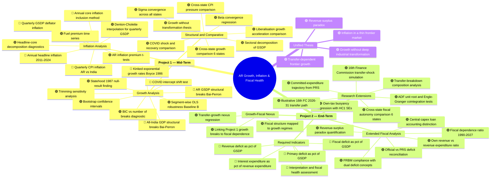

# Supplementary Overview: Financial Programming Projects 1 & 2
## Arunachal Pradesh — Growth, Inflation, and Fiscal Health
**Student:** S.M. Muzammil Afroz | **State:** Arunachal Pradesh (AR)  
**Course:** Financial Programming | **Instructor:** Prof. M. Parameswaran  
**Institution:** Centre for Development Studies

---

## Why Arunachal Pradesh Demanded More Than a Standard Report

Arunachal Pradesh is not like any other Indian state. It is a landlocked, sparsely populated, frontier hill state with:

- **No urban CPI data at all** — the Urban column is 100% NA across all items and all years (2011–2025). Combined CPI values, where they sporadically exist (~8–10 observations), are identical to Rural. This meant the standard All-India methodology for headline/core inflation could not be applied mechanically to AR.
- **No housing component in CPI** — AR CPI has no housing index or weight. Core inflation had to be computed with only two items (Clothing+footwear and Miscellaneous) instead of the standard three.
- **Pre-statehood data complications** — AR was NEFA (a centrally administered territory) until 1987. GSDP data starting from 1980-81 includes NEFA-era central administration accounts.
- **Extreme transfer dependence** — over 83% of revenue receipts come from the Centre, making standard fiscal health ratios misleading if taken at face value.
- **A services economy dominated by public administration** — not by market-driven services, which changes how growth and inflation interact.

These structural peculiarities meant that a standard descriptive report would miss the actual economic story. The additional analyses below were necessary to tell a coherent, honest research narrative.

---

## Complete Work Map

The diagram below shows **every analysis performed** across both projects. Items in **blue** are what was explicitly asked in the assignment. Items in **green** are extensions I added to build a coherent research narrative.

> **Legend:** 🔵 = Required by assignment | 🟢 = Extended analysis added for research depth

---

## Section-by-Section: What Was Done and Why

### Project 1

| # | Analysis | Required? | Why I Did It |
|---|----------|-----------|--------------|
| 1 | Bai-Perron structural breaks for All-India and AR | ✅ Required | Core assignment requirement |
| 2 | Boyce kinked growth rates (Baseline A) | ✅ Required | Mandated methodology from Balakrishnan & Parameswaran (2007) |
| 3 | Segment-wise OLS (Baseline B) | 🟢 Extra | The Boyce model imposes continuity at breaks. AR has a 17.75% fitted level shift at the 1995 break — reporting only Baseline A would hide this. Baseline B provides transparent robustness |
| 4 | 1987 statehood null-result | 🟢 Extra | Everyone expects AR's statehood year (1987-88) to be a structural break. Bai-Perron says no — the breaks are 1995 and 2013. This is itself a novel empirical finding |
| 5 | Trimming sensitivity & bootstrap CIs | 🟢 Extra | To confirm the break-date results are not sensitive to the trimming parameter choice (tested ε = 0.10 to 0.20) |
| 6 | COVID intercept test | ✅ Suggested | Assignment suggested testing for a 2020-21 intercept shift; done as a one-year pulse dummy |
| 7 | Quarterly CPI inflation, AR vs All-India | ✅ Required | Core assignment requirement |
| 8 | GSDP deflator inflation via Denton-Cholette | ✅ Required (quarterly) | AR has only annual GSDP. To compute quarterly deflator inflation as asked, Denton-Cholette temporal disaggregation was necessary |
| 9 | Annual headline and core inflation | ✅ Required | Core assignment requirement. AR core uses only 2 items (no housing, no urban) — this constraint itself is a finding |
| 10 | Inflation premium analysis | 🟢 Extra | AR rural CPI consistently exceeds All-India Combined CPI. The **fuel premium** is statistically significant (t=3.33, p=0.007), supporting the supply-chain and transport-cost hypothesis for a frontier economy |
| 11 | Sectoral decomposition | 🟢 Extra | Agriculture fell from 89% to 18%, but industry stayed flat at ~25%. Services rose to 49%, dominated by public administration. This is essential context for the "growth without transformation" thesis |
| 12 | Convergence analysis | 🟢 Extra | Assignment suggested comparing with other states. Sigma-convergence shows widening inequality (SD rose from 0.41 to 0.55). Beta-convergence is not statistically significant |
| 13 | Cross-state comparison (6 states) | 🟢 Extra | Assignment encouraged collecting other states' results. I compared AR with Assam, Sikkim, HP, Tripura, and Meghalaya for growth regimes, COVID shock severity, and CPI pressure |

### Project 2

| # | Analysis | Required? | Why I Did It |
|---|----------|-----------|--------------|
| 1 | Revenue/Fiscal/Primary balance as % of GSDP | ✅ Required | Core assignment requirement; computed for 2022-23 to 2026-27 |
| 2 | Interest/Revenue expenditure ratio | ✅ Required | Core assignment; interest burden is very low (3.6–4.8%) |
| 3 | Fiscal health interpretation | ✅ Required | This is where the depth became necessary — a simple "ratios look fine" conclusion would be misleading for AR |
| 4 | Revenue-surplus paradox | 🟢 Extra | AR records revenue surplus of 8.9–18.0% of GSDP, yet finances only 17–19% of expenditure from own revenue. This paradox is the central interpretive finding |
| 5 | Fiscal dependence ratio (1990–2027) | 🟢 Extra | Shows that 83–88% transfer dependence has persisted for the entire available history. The structure is not recent |
| 6 | Official vs PRS deficit reconciliation | 🟢 Extra | The official AR fiscal deficit is ~1.7% of GSDP, but the PRS-style broad deficit is ~11.0%. The difference is central capex loans. Not reporting both would be academically incomplete |
| 7 | Own-tax buoyancy regression | 🟢 Extra | Elasticity is 1.69 (HC1 SE: 0.03) — own tax is buoyant, not weak. But the base is too small relative to expenditure. This refines the common claim |
| 8 | ADF + Engle-Granger diagnostics | 🟢 Extra | ADF rejects unit roots but Engle-Granger does not reject no-cointegration (p≈0.098). The buoyancy coefficient must be framed as descriptive, not causal |
| 9 | 16th FC transfer-shock simulation | 🟢 Extra | AR's devolution share falls from 1.76% to 1.35% under the 16th FC. I simulated the revenue-balance impact: ~Rs 6,276 crore loss relative to no-share-cut counterfactual |
| 10 | Cross-state fiscal comparison | 🟢 Extra | AR has the highest fiscal dependence (86.5%) among all 6 comparator states in 2023-24. Assam and HP show much lower dependence (62–63%) |
| 11 | Committed-expenditure trajectory | 🟢 Extra | Salaries + pensions + interest absorb 34% of revenue receipts in 2024-25 and are projected to reach 60% by 2026-27 BE |
| 12 | Transfer breakdown composition | 🟢 Extra | Splits revenue receipts into tax devolution, CSS grants, FC grants, other grants, and own revenue — showing the composition of transfer dependence |
| 13 | Growth-fiscal nexus | 🟢 Extra (asked in Project 2 brief) | Assignment explicitly says "check the relationship between performance of the State's economy and government finance." I linked Project 1 growth breaks to fiscal dependence |

---

## Key Empirical Findings

### Project 1 Highlights

| Finding | Detail |
|---------|--------|
| AR break years | **1995-96** and **2013-14** — not 1987-88 (statehood) or 1991 (liberalisation) |
| AR growth trend | Decelerating: 7.63% → 6.61% → 5.54% across three regimes |
| 1987 statehood | **Not a structural break** — growth was already on the NEFA-era trajectory |
| COVID shock (AR) | -3.69% real GSDP fall — milder than Meghalaya (-7.85%), similar to HP (-4.40%) |
| AR inflation premium | Fuel premium = +2.84 pp (significant at 1%), reflecting transport costs |
| AR urban CPI | **Does not exist** — 100% NA across all items and years |

### Project 2 Highlights

| Finding | Detail |
|---------|--------|
| Revenue surplus / GSDP | 8.9% to 18.0% (2022-23 to 2026-27) |
| Own revenue / Revenue expenditure | Only 17–19% — the state cannot self-finance |
| Central transfer dependence | 83–88% of revenue receipts, persistently since 1990-91 |
| Official fiscal deficit | ~1.7% of GSDP (looks manageable) |
| Broad PRS-style deficit | ~11.0% of GSDP (very different picture) |
| 16th FC impact | Devolution share falls 1.76% → 1.35%, costing ~Rs 6,276 crore |

---

## Output Inventory

### Figures (27 total)

| Figure | Content |
|--------|---------|
| fig1 – fig4b | Growth trends, structural breaks, kinked/segment-wise fits |
| fig5 – fig7 | Quarterly CPI, headline vs core inflation, sigma convergence |
| fig8 – fig11 | Fiscal dependence, fiscal balances, interest, own revenue |
| fig12 – fig16 | Cross-state growth, COVID shock, CPI pressure, fuel premium |
| fig17 – fig25 | Project 2: deficit reconciliation, revenue composition, tax buoyancy, transfer shock, cross-state comparison, long-run indicators, committed expenditure, transfer breakdown, 16th FC path |

### Tables (35 total)

Tables 1–10: Project 1 growth, breaks, inflation, robustness  
Tables 11–22: Project 2 fiscal indicators, extended analysis  
Tables 23–31: Project 2 research extensions (buoyancy, 16th FC, cross-state, diagnostics)

### Final Papers

- **Project 1:** LaTeX-compiled, 57,890 bytes, with BibTeX references (10,637 bytes)
- **Project 2:** LaTeX-compiled, 58,475 bytes, with 47 tracked editorial revisions

---

## Data Sources Used

| Source | Role |
|--------|------|
| EPWRF India Time Series | All-India GDP, AR GSDP (constant + current prices), Per Capita NSDP |
| NAS 2011-12 Series | All-India GDP at constant and current prices |
| CPI Base Year 2012 (All-India & AR) | Monthly CPI indices for inflation analysis |
| RBI State Finance Database | Backbone for all fiscal analysis (1990-91 to 2023-24) |
| Official AR Budget Documents 2026-27 | Budget at a Glance, Annual Financial Statement, FRBM Statement, Budget Speech, Demands for Grants |
| PRS Legislative Research | Budget analysis 2026-27, 16th Finance Commission summary |
| All-States GSDP Backseries 1960-2025 | Cross-state growth comparison |
| All-States CPI Group Indices | Cross-state inflation comparison |
| ALL STATES FINANCE DATABASE | Cross-state fiscal comparison |

---

*This document accompanies the submitted Project 1 and Project 2 papers. All analyses are reproducible from `full_analysis.ipynb` (R kernel, IRkernel).*
