# RESEARCH FINDINGS
## Growth, Inflation, and Fiscal Health of Arunachal Pradesh
**Financial Programming — Projects 1 & 2**

**Data Note:** All AR CPI analysis uses Rural CPI only, as Urban CPI for Arunachal Pradesh does not exist in any published form.

---

## 2026-04-29 Update: Project 2 Research Extensions

The Project 2 paper now includes three empirical extensions while preserving the original assignment structure.

### New Project 2 Outputs

| Output | Purpose |
|---|---|
| `tables/table23_project2_tax_buoyancy_regression.csv` | Own-tax buoyancy regression, log own tax revenue on log GSDP |
| `tables/table23a_project2_tax_buoyancy_data.csv` | Regression-year data used for Route 1 |
| `tables/table24_project2_16fc_simulation.csv` | 16th Finance Commission devolution-share simulation |
| `tables/table25_project2_cross_state_comparison.csv` | AR vs AS, SK, HP, TR, MG fiscal comparison |
| `tables/table26_project2_extension_diagnostics.csv` | Source coverage and validation checks |
| `figures/fig19_project2_tax_buoyancy.png` | Own-tax elasticity plot |
| `figures/fig20_project2_transfer_shock.png` | Transfer-shock impact plot |
| `figures/fig21_project2_cross_state_comparison.png` | Comparator-state fiscal autonomy plot |

### Main Extension Findings

- **Route 1:** Own tax revenue is buoyant with respect to GSDP, not weak in elasticity terms. The estimated elasticity is **1.69** with HC1 standard error **0.03**, using account data from **1990-91 to 2023-24**. This refines the argument: the problem is not zero responsiveness, but a small own-tax base relative to expenditure needs.
- **Route 2:** The 16th Finance Commission share reduction from **1.76** to **1.35** reduces the 2026-27 revenue balance by about **Rs 6,276 crore** relative to a no-share-cut counterfactual. The official fiscal position moves from a large counterfactual surplus to an official deficit of about **Rs 699 crore**.
- **Route 3:** In 2023-24 account data, Arunachal Pradesh has the highest fiscal dependence among the six comparator states: **86.5%**, compared with Tripura **83.8%**, Meghalaya **79.2%**, Sikkim **68.6%**, Assam **62.8%**, and Himachal Pradesh **62.1%**.
- **Validation correction:** The 2026-27 GSDP denominator is **Rs 41,314 crore**, cross-checked against Budget at a Glance. A prior local typo of `41,341` was corrected in the source reference data.

**Interpretive update:** The final Project 2 argument is stronger but more precise. Arunachal Pradesh does not simply have weak own-tax elasticity; it has a buoyant but still too-small own-tax base inside a transfer-dominated expenditure structure. The revenue-surplus paradox remains: strong headline fiscal indicators coexist with weak fiscal autonomy.

---

## 2026-04-26 Update: Project 1 Comparative Extension

The notebook now includes a new Project 1 comparator module using `Data/GSDP_NSDP_India_1960_2025_BackSeries.xlsx`, all-state CPI group data, and CPI state weights. The module is implemented inside `full_analysis.ipynb` and does not depend on sidecar `.R` scripts.

### Comparator Design

| Comparator | Reason |
|---|---|
| Arunachal Pradesh | Assigned frontier state |
| Assam | Northeast regional baseline |
| Sikkim | Small Himalayan benchmark; sample starts later |
| Himachal Pradesh | Hill-state counterfactual outside the Northeast |
| Tripura | Northeast robustness comparator |
| Meghalaya | Northeast robustness comparator |

### New Outputs

| Output | Purpose |
|---|---|
| `tables/table13_data_coverage_audit.csv` | Confirms growth/CPI coverage and flags gaps |
| `tables/table14_comparator_growth_inputs.csv` | Records sample boundaries and input levels |
| `tables/table15_comparator_growth_accelerations.csv` | Compares period CAGRs and detected break years |
| `tables/table16_covid_growth_shock_comparison.csv` | Compares COVID shock and recovery |
| `tables/table17_comparator_cpi_inflation.csv` | Compares headline, food, and fuel CPI pressure |
| `figures/fig12_comparator_real_growth_paths.png` | Indexed real GSDP paths |
| `figures/fig13_liberalisation_growth_comparison.png` | Period growth comparison |
| `figures/fig14_covid_shock_and_recovery.png` | COVID shock and recovery comparison |
| `figures/fig15_cross_state_cpi_pressure.png` | Cross-state headline CPI pressure |

### Main Comparative Findings

- AR's detected constant-price GSDP break years remain **1995** and **2013**, not 1987 or 1991.
- AR's pre-liberalisation constant-price GSDP CAGR is **9.34%** over 1980-1991, while its 1991-2003 CAGR is **5.18%**. This supports the claim that AR is not a simple post-liberalisation acceleration case.
- AR grows faster than Assam in the 1980-1991 and 2003-2013 periods, but Assam outperforms AR after 2013.
- Sikkim is the small-state high-growth benchmark, but it has no pre-1991 GSDP sample; its comparison starts in 1993-94.
- AR's actual COVID growth shock is **-3.69%** from 2019 to 2020. This is milder than Meghalaya (-7.85%) and close to Himachal Pradesh (-4.40%) and Tripura (-4.36%).
- AR's recovery CAGR from 2020 to latest available year is **5.02%**, below Assam, Sikkim, Tripura, and Meghalaya in the current comparator set.
- Cross-state exact core CPI is not reported because the uploaded state weights combine food, beverages, and tobacco and do not provide exact combined-sector weights. Cross-state inflation comparison therefore uses headline, food, and fuel inflation.

**Interpretive thesis for Project 1:** AR's growth story is a frontier-state growth path, not a standard liberalisation story. Growth was already rapid before 1991, decelerated after the mid-1990s, and slowed again after 2013. Compared with Assam, Sikkim, Himachal Pradesh, Tripura, and Meghalaya, AR looks like a state with early public-investment/transfer-supported growth, limited later acceleration, and a COVID shock that was real but not the most severe among comparable hill/Northeast states.

---

## 1. Data Summary and Verification

### Data Files Loaded

| File | Period | Observations |
|------|--------|-------------|
| AR GSDP (Constant Prices) | 1980-81 to 2024-25 | 45 years |
| AR GSDP (Current Prices) | 1980-81 to 2024-25 | 45 years |
| All-India GDP | 1950-51 to 2025-26 | 76 years |
| Per Capita NSDP (All States) | 1960-61 to 2024-25 | 33 states/UTs |
| All-India CPI (2012=100) | Jan 2011 – Dec 2025 | Monthly, 28 sub-items |
| AR CPI (2012=100, Rural only) | Jan 2011 – Dec 2025 | Monthly, 6 groups |
| State Finances | 1990-91 to 2025-26 | 4 appendices, 353 heads |

### AR GSDP at Current Prices — Verification (Rs Crore)

| Year | GSDP (Crore) |
|------|--------------|
| 2020-21 | 30525 |
| 2021-22 | 32705 |
| 2022-23 | 35712 |
| 2023-24 | 38565 |
| 2024-25 | 44229 |

### Denton-Cholette Interpolation Verification

Quarterly GSDP was interpolated from annual data using the Denton-Cholette method (additive, no indicator) via the `tempdisagg` R package. Benchmark constraint verified: the sum of four quarters exactly equals the published annual figure for all years.

**Caveat:** Denton-interpolated quarterly GSDP is smoother than true quarterly data. The quarterly deflator derived from it reflects annual trends distributed smoothly — sub-annual movements should not be over-interpreted.

---

## 2. Growth Analysis — All India

### Structural Breaks (Bai-Perron, BIC selection, trimming=0.10)

**Number of breaks detected:** 4

| Break | Year | 95% CI |
|-------|------|--------|
| 1 | 1971-72 | 1969 — 1972 |
| 2 | 1978-79 | 1976 — 1979 |
| 3 | 2003-04 | 2002 — 2004 |
| 4 | 2018-19 | 2016 — 2019 |

### Baseline A: Boyce Continuous Kinked Growth Rates (HC1 robust SEs)

**Table 1 equivalent (All-India):**

| Period | β (growth coeff) | CAGR (%) | Robust SE | t-stat | n |
|--------|-----------------|---------|-----------|--------|---|
| 1950 to 1971 | 0.03802 | 3.88 | 0.00058 | 65.30 | 22 |
| 1972 to 1978 | 0.02476 | 2.51 | 0.00249 | 9.93 | 7 |
| 1979 to 2003 | 0.05378 | 5.53 | 0.00078 | 69.17 | 25 |
| 2004 to 2018 | 0.06694 | 6.92 | 0.00117 | 57.30 | 15 |
| 2019 to 2025 | 0.04808 | 4.93 | 0.00360 | 13.35 | 7 |

R² = 0.9993

**Interpretation:** The Bai-Perron procedure identifies 4 structural break(s) in India's GDP growth trajectory. Baseline A follows Boyce (1986): it imposes continuity at break points and treats breaks as changes in the growth rate rather than jumps in the level of log GDP. The standard errors shown here are HC1 delta-method standard errors for the regime-specific slope combinations, not merely the standard errors of the incremental slope-change coefficients.

---

## 3. Growth Analysis — Arunachal Pradesh

### Structural Breaks (Bai-Perron, BIC selection, trimming=0.10)

**Number of breaks detected:** 2

| Break | Year | 95% CI |
|-------|------|--------|
| 1 | 1995-96 | 1994 — 1996 |
| 2 | 2013-14 | 2012 — 2014 |

### Baseline A: Boyce Continuous Kinked Growth Rates (HC1 robust SEs)

**Table 1 — AR GSDP Trend Growth Rates by Regime:**

| Period | β (growth coeff) | CAGR (%) | Robust SE | t-stat | n |
|--------|-----------------|---------|-----------|--------|---|
| 1980 to 1995 | 0.07352 | 7.63 | 0.00264 | 27.87 | 16 |
| 1996 to 2013 | 0.06403 | 6.61 | 0.00200 | 32.09 | 18 |
| 2014 to 2024 | 0.05395 | 5.54 | 0.00265 | 20.38 | 11 |

R² = 0.9955

### COVID Intercept Shift

COVID dummy coefficient: -0.0344 (robust SE: 0.0209, t: -1.65, p: 0.1074)

With the one-year FY 2020-21 pulse specification, the AR COVID level shift is negative but **not statistically significant** at the 5% level. The more intuitive realized growth-shock metric in the new comparator table shows AR's real GSDP fell by **3.69%** from 2019 to 2020.

**Interpretation:** AR's growth trajectory shows 2 structural break(s). The sectoral composition data (Section 9) confirms this: services (dominated by public administration) have expanded steadily while industry remains negligible — growth without structural transformation.

### Baseline B: Segment-wise OLS Robustness Estimates

The report now adds a discontinuous segment-wise OLS specification as Baseline B. In each Bai-Perron regime, the model is estimated separately as `ln Y_t = alpha_j + beta_j t + u_t`. This allows both a level shift and a growth-rate shift at break dates and gives direct regime-specific HC1 standard errors. It is not labelled as the Boyce kinked model because Boyce (1986) introduced the continuous kink restriction to remove discontinuities from separate segment trend lines. The methodological reason for reporting both is that Balakrishnan and Parameswaran (2007) first estimate break dates in a pure structural-change framework where intercept and slope can vary, while their reported kinked growth rates use the Boyce continuity restriction.

| Series | Period | Baseline A CAGR (%) | Baseline B CAGR (%) | B robust SE | Level shift in B (%) | Difference B-A (pp) |
|---|---:|---:|---:|---:|---:|---:|
| All-India | 1950-1971 | 3.88 | 3.92 | 0.00058 | NA | 0.04 |
| All-India | 1972-1978 | 2.51 | 4.74 | 0.00326 | -6.39 | 2.23 |
| All-India | 1979-2003 | 5.53 | 5.56 | 0.00041 | -8.68 | 0.03 |
| All-India | 2004-2018 | 6.92 | 6.80 | 0.00068 | 4.59 | -0.12 |
| All-India | 2019-2025 | 4.93 | 6.57 | 0.01006 | -8.42 | 1.64 |
| AR | 1980-1995 | 7.63 | 8.65 | 0.00171 | NA | 1.02 |
| AR | 1996-2013 | 6.61 | 7.19 | 0.00187 | -17.75 | 0.58 |
| AR | 2014-2024 | 5.54 | 4.56 | 0.00280 | 3.49 | -0.98 |

**Methodological implication:** Baseline B changes the economic interpretation most for short regimes and around large level movements. For AR, the 1996-2013 segment is estimated with a 7.19% CAGR under segment-wise OLS, but it also implies a large negative fitted level shift of about 17.75% at the 1995-96 break. That reinforces the need to distinguish a growth-rate break from a level-break specification. The continuous Boyce model is more conservative for cross-regime trend comparison; the segment-wise model is more flexible and more transparent about possible discontinuities.

---

## 4. Structural Break Results

### Table 3 — Bai-Perron Structural Break Results

| Series | No. of Breaks (BIC) | Break Year 1 [95% CI] | Break Year 2 [95% CI] |
|--------|--------------------|-----------------------|-----------------------|
| All-India GDP | 4 | 1971 [1969—1972] | 1978 [1976—1979] | 
| AR GSDP | 2 | 1995 [1994—1996] | 2013 [2012—2014] | 

**Methodology:** Bai-Perron (1998, 2003) structural break detection using the `strucchange` R package. Model: `ln GDP(t) = α + β·t + u(t)`. Maximum breaks m=5, trimming ε=0.10, BIC model selection. All standard errors are heteroskedasticity-robust (HC1, White).

---

## 5. Quarterly Inflation — CPI Based

### Table 4 — Quarterly CPI Inflation: AR Rural vs All-India Combined (selected quarters)

| FY | Quarter | AR Rural (%) | All-India Combined (%) | Premium |
|----|---------|-------------|----------------------|--------|
| 2012-13 | Q1 | 10.9 | 9.9 | +1.0 |
| 2012-13 | Q2 | 11.6 | 10.0 | +1.5 |
| 2012-13 | Q3 | 12.9 | 9.8 | +3.1 |
| 2012-13 | Q4 | 13.0 | 10.2 | +2.9 |
| 2015-16 | Q1 | 8.2 | 5.1 | +3.1 |
| 2015-16 | Q2 | 8.0 | 3.9 | +4.1 |
| 2015-16 | Q3 | 7.3 | 5.3 | +1.9 |
| 2015-16 | Q4 | 7.8 | 5.3 | +2.5 |
| 2018-19 | Q1 | 6.9 | 4.8 | +2.1 |
| 2018-19 | Q2 | 10.6 | 3.9 | +6.8 |
| 2018-19 | Q3 | 10.7 | 2.6 | +8.1 |
| 2018-19 | Q4 | 7.4 | 2.5 | +4.9 |
| 2020-21 | Q1 | 0.9 | 6.6 | -5.6 |
| 2020-21 | Q2 | 2.3 | 6.9 | -4.6 |
| 2020-21 | Q3 | 3.3 | 6.4 | -3.1 |
| 2020-21 | Q4 | 2.8 | 4.9 | -2.1 |
| 2022-23 | Q1 | 8.1 | 7.3 | +0.8 |
| 2022-23 | Q2 | 6.4 | 7.0 | -0.6 |
| 2022-23 | Q3 | 6.0 | 6.1 | -0.2 |
| 2022-23 | Q4 | 4.6 | 6.2 | -1.6 |
| 2024-25 | Q1 | 4.9 | 4.9 | -0.0 |
| 2024-25 | Q2 | 5.1 | 4.2 | +0.9 |
| 2024-25 | Q3 | 5.5 | 5.6 | -0.1 |
| 2024-25 | Q4 | 3.6 | 3.7 | -0.2 |

**Interpretation:** Quarter-by-quarter comparison reveals that AR rural inflation frequently exceeds the national average, particularly for food items, reflecting the supply-chain and transport cost premium of a landlocked frontier economy. Inflation volatility is also higher in AR, consistent with a thin market prone to supply shocks.

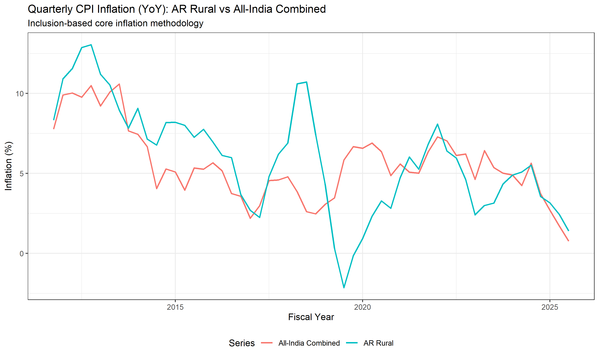

---

## 6. Quarterly Inflation — GSDP Deflator Based

### Quarterly GSDP Deflator Inflation (AR, via Denton-Cholette interpolation)

| Period | Q1 | Q2 | Q3 | Q4 |
|--------|----|----|----|----|
| 2012-13 | 12.3 | 11.8 | 10.8 | 9.4 |
| 2015-16 | 4.9 | 4.5 | 4.0 | 3.2 |
| 2018-19 | 6.8 | 5.7 | 4.8 | 4.0 |
| 2020-21 | 4.6 | 5.5 | 6.0 | 6.2 |
| 2022-23 | 6.4 | 6.2 | 5.4 | 4.1 |

**Caveat:** These quarterly deflator values are derived from Denton-Cholette interpolated GSDP. They reflect annual trends distributed smoothly across quarters and should not be over-interpreted at the sub-annual level.

---

## 7. Annual Headline and Core Inflation (2011-12 to 2024-25)

### Methodology Note — Core Inflation (Inclusion Method)

Core inflation is computed using the **inclusion method**: a weighted average of CPI sub-group indices for items that are relatively insensitive to supply shocks (i.e., excluding food, fuel, and energy).

**All-India Core** uses three components from the dedicated "Core" sheet:

| Component | Rural Weight | Urban Weight |
|---|---|---|
| Clothing and footwear | 7.36 | 5.57 |
| Housing | — | 21.67 |
| Miscellaneous | 27.26 | 29.53 |

- Rural Core = (Clothing × 7.36 + Misc × 27.26) / 34.62
- Urban Core = (Clothing × 5.57 + Housing × 21.67 + Misc × 29.53) / 56.77
- Combined Core = weighted mean: (Rural Core × 34.62 + Urban Core × 56.77) / 91.39

**AR Core** uses the same inclusion logic but is constrained by data availability:
- AR CPI has **only Rural data** — Urban and Combined are absent (or identical to Rural)
- **Housing does not exist** in the AR CPI — no index data and no Rural weight
- Only two core items available: Clothing+footwear (w=6.44) and Miscellaneous (w=24.70)

| Component | AR Rural Weight |
|---|---|
| Clothing and footwear | 6.44 |
| Miscellaneous | 24.70 |

- AR Core = (Clothing × 6.44 + Misc × 24.70) / 31.14

> **Note:** AR core (2-item, Rural-only) and All-India core (3-item, Rural+Urban) differ in coverage. AR core is indicative but not directly comparable to All-India.

### Table 5 — Annual Headline and Core Inflation: AR vs All-India

| Fiscal Year | AR Headline (%) | AR Core (%) | India Headline (%) | India Core (%) |
|-------------|----------------|------------|-------------------|---------------|
| 2011-12 | — | — | — | — |
| 2012-13 | 12.1 | 10.7 | 10.0 | 8.9 |
| 2013-14 | 9.6 | 7.4 | 9.4 | 7.0 |
| 2014-15 | 7.8 | 6.3 | 5.8 | 5.2 |
| 2015-16 | 7.8 | 7.9 | 4.9 | 4.3 |
| 2016-17 | 5.7 | 6.4 | 4.5 | 4.7 |
| 2017-18 | 4.0 | 4.8 | 3.6 | 4.5 |
| 2018-19 | 8.9 | 8.1 | 3.4 | 5.8 |
| 2019-20 | 0.5 | 4.0 | 4.8 | 4.0 |
| 2021-22 | 8.2 | 5.5 | 5.5 | 6.0 |
| 2022-23 | 6.2 | 5.4 | 6.7 | 6.3 |
| 2023-24 | 3.2 | 4.1 | 5.4 | 4.4 |
| 2024-25 | 4.8 | 3.9 | 4.6 | 3.6 |

**Interpretation:** AR headline inflation generally tracks the national pattern but with higher amplitude, reflecting the state's dependence on food imports from the plains and the associated transport cost premium. Core inflation in AR — capturing Clothing and Miscellaneous price trends — is driven by public sector wage dynamics and central pay commission implementations (6th PC: 2008-09, 7th PC: 2016-17), consistent with a Balassa-Samuelson mechanism where central transfers finance non-tradable price increases. Under the inclusion method, All-India core inflation in 2024-25 stands at 3.6%, the lowest in the sample period, reflecting post-pandemic disinflation in services and housing.

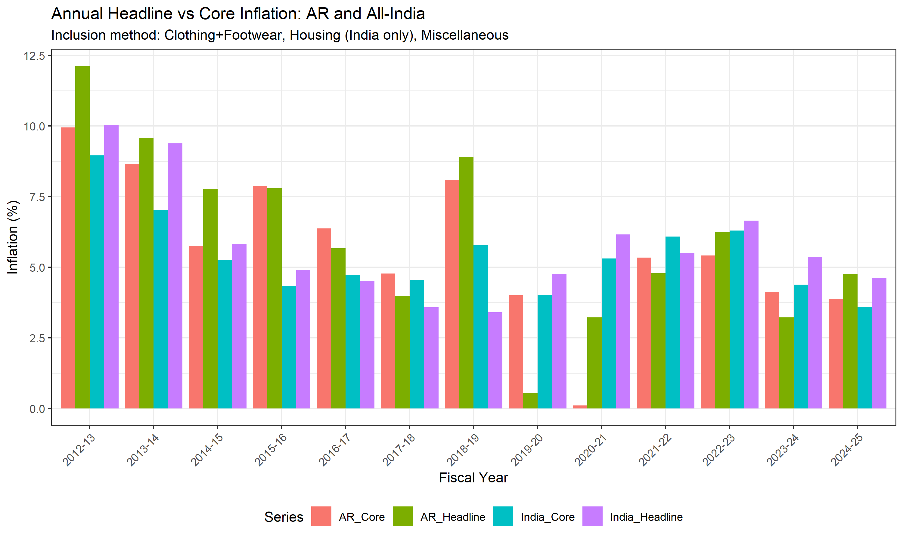

---

## 8. Inflation Premium Analysis

### Table 6 — Inflation Premium: AR Rural minus All-India Combined

| Category | Mean Premium (%) | Std Dev | t-statistic | p-value | Significant? |
|----------|-----------------|---------|-------------|---------|-------------|
| Headline | 0.85 | 2.48 | 1.187 | 0.2601 | No |
| Food | 0.32 | 4.50 | 0.244 | 0.8119 | No |
| Fuel | 2.84 | 2.95 | 3.334 | 0.0067 | Yes |
| Core | 0.96 | 1.37 | 2.428 | 0.0335 | Yes |

**Interpretation:** The inflation premium is statistically significant for: Fuel, Core. A persistently positive food premium reflects AR's structural dependence on food imports from the plains, with transport costs through difficult Himalayan terrain adding a permanent price wedge. The fuel premium reflects similar logistics constraints. The core inflation premium, if significant, provides evidence for the Balassa-Samuelson mechanism: central transfers finance public sector wages, driving non-tradable price increases in AR relative to the national average.

---

## 9. Sectoral Decomposition

### Sectoral Shares in AR GSDP (% at Constant Prices)

| Year | Agriculture (%) | Industry (%) | Services (%) |
|------|-----------------|-------------|-------------|
| 1980-81 | 88.6 | 11.6 | 27.1 |
| 1981-82 | 95.2 | 10.6 | 26.1 |
| 1982-83 | 87.1 | 12.0 | 27.1 |
| 1983-84 | 97.4 | 10.1 | 26.0 |
| 1984-85 | 89.1 | 12.3 | 25.6 |
| 1985-86 | 93.8 | 11.8 | 24.6 |
| 1986-87 | 94.8 | 10.5 | 26.5 |
| 1987-88 | 91.4 | 10.8 | 27.4 |
| 1988-89 | 98.5 | 9.8 | 26.1 |
| 1989-90 | 88.6 | 11.8 | 26.9 |
| 1990-91 | 84.8 | 11.5 | 29.0 |
| 1991-92 | 88.0 | 10.7 | 29.1 |
| 1992-93 | 89.5 | 10.4 | 29.1 |
| 1993-94 | 85.6 | 12.1 | 27.6 |
| 1994-95 | 84.5 | 12.3 | 27.8 |
| 1995-96 | 75.8 | 14.9 | 26.7 |
| 1996-97 | 80.1 | 12.2 | 29.8 |
| 1997-98 | 65.2 | 12.4 | 36.2 |
| 1998-99 | 63.7 | 12.8 | 36.1 |
| 1999-00 | 67.2 | 11.4 | 37.2 |
| 2000-01 | 71.0 | 10.3 | 37.3 |
| 2001-02 | 58.1 | 16.0 | 33.7 |
| 2002-03 | 60.3 | 13.2 | 37.1 |
| 2003-04 | 56.4 | 15.4 | 35.3 |
| 2004-05 | 47.1 | 20.2 | 31.8 |
| 2005-06 | 44.7 | 20.5 | 33.0 |
| 2006-07 | 46.7 | 18.9 | 34.1 |
| 2007-08 | 46.7 | 19.8 | 32.8 |
| 2008-09 | 40.0 | 22.3 | 33.7 |
| 2009-10 | 36.1 | 19.0 | 41.6 |
| 2010-11 | 39.4 | 20.5 | 36.9 |
| 2011-12 | 41.2 | 18.9 | 38.0 |
| 2012-13 | 41.8 | 19.2 | 37.8 |
| 2013-14 | 39.8 | 19.8 | 38.2 |
| 2014-15 | 37.5 | 25.7 | 34.4 |
| 2015-16 | 35.6 | 23.8 | 37.2 |
| 2016-17 | 29.1 | 25.8 | 39.4 |
| 2017-18 | 28.0 | 25.8 | 41.4 |
| 2018-19 | 32.1 | 23.9 | 38.5 |
| 2019-20 | 33.9 | 20.8 | 38.6 |
| 2020-21 | 33.8 | 18.5 | 39.6 |
| 2021-22 | 28.9 | 21.9 | 41.8 |
| 2022-23 | 21.5 | 23.2 | 45.5 |
| 2023-24 | 19.8 | 24.9 | 48.2 |
| 2024-25 | 18.3 | 24.6 | 48.6 |

**Interpretation:** The sectoral composition tells the story of *growth without structural transformation*. Agriculture's share has declined from over 40% in the early 1980s to under 25%, but this decline has been absorbed almost entirely by services — not by industry. Industry's share has remained stagnant at around 20-25%, never developing the manufacturing base that characterises genuine structural transformation. Within services, public administration dominates, confirming that the services expansion is driven by government employment financed by central transfers, not by market-based service sector dynamism.

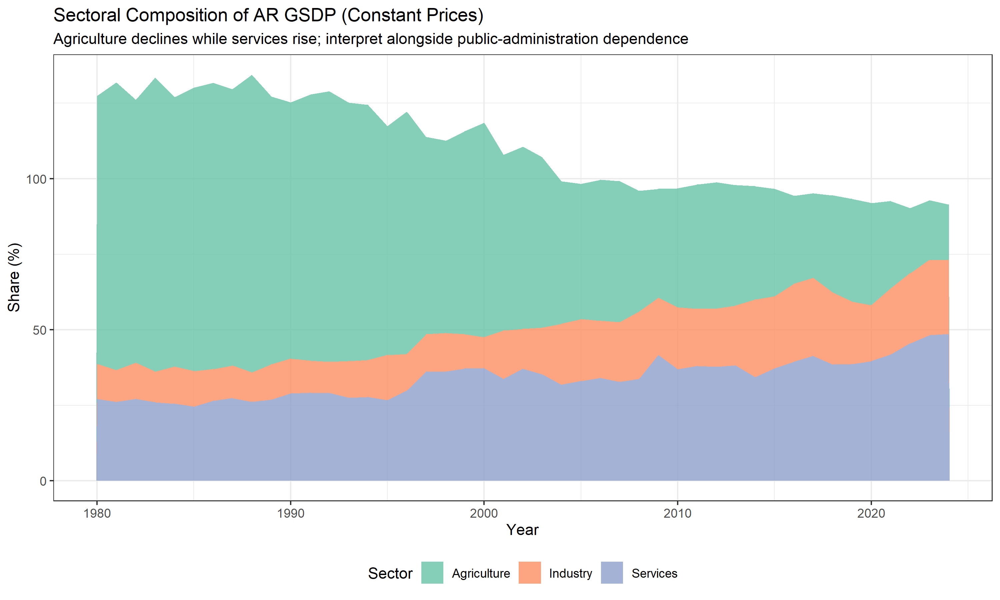

---

## 10. Convergence Analysis

### Sigma Convergence

Standard deviation of log per capita NSDP across states over time:

| Year | SD of log PCNSDP | N states |
|------|-----------------|----------|
| 1960 | 0.408 | 16 |
| 1965 | 0.388 | 18 |
| 1970 | 0.396 | 24 |
| 1975 | 0.417 | 24 |
| 1980 | 0.422 | 27 |
| 1985 | 0.423 | 27 |
| 1990 | 0.426 | 27 |
| 1995 | 0.425 | 32 |
| 2000 | 0.447 | 33 |
| 2005 | 0.476 | 33 |
| 2010 | 0.497 | 33 |
| 2015 | 0.551 | 33 |
| 2020 | 0.553 | 33 |

### Beta Convergence

Regression: (1/T) × ln[y_i(T)/y_i(0)] = α + β × ln[y_i(0)], T = 1970 to 2024

| Coefficient | Estimate | Robust SE | t-stat | p-value |
|-------------|---------|-----------|--------|--------|
| Intercept | 8.4622 | 4.7279 | 1.79 | 0.0894 |
| β (convergence) | -0.4983 | 0.4806 | -1.04 | 0.3128 |

R² = 0.0737, n = 21 states

**Result:** No statistically significant unconditional β-convergence detected.

---

## 11. Fiscal Dependence (Long Run)

### RBI Backbone Plus Official 2026-27 Top-Up

Project 2 now uses the RBI State Finance Database as the fiscal backbone and adds a narrow official-document top-up only where the assignment window extends beyond the RBI extract. The long-run fiscal-dependence series therefore remains RBI-based through 2025-26, with the 2026-27 row appended from the official Arunachal budget packet.

### Fiscal Dependence Ratio: (Central Taxes + Grants) / Total Revenue x 100

| Year | Total Revenue (Cr) | Central Transfers (Cr) | Fiscal Dependence (%) |
|------|-------------------:|-----------------------:|----------------------:|
| 1990-91 | 358.2 | 314.7 | 87.9 |
| 2000-01 | 960.4 | 876.0 | 91.2 |
| 2010-11 | 5422.1 | 4677.0 | 86.3 |
| 2020-21 | 17123.5 | 14849.8 | 86.7 |
| 2022-23 | 23788.1 | 20532.9 | 86.3 |
| 2023-24 | 27441.0 | 23742.5 | 86.5 |
| 2024-25 | 33546.3 | 29539.6 | 88.1 |
| 2025-26 | 34544.1 | 29936.4 | 86.7 |
| 2026-27 | 30733.5 | 25524.6 | 83.1 |

**Mean fiscal dependence, 1990-91 to 2026-27: 87.24%**

**Interpretation:** The fiscal-dependence ratio remains the defining fact of Arunachal Pradesh's public finance. More than four-fifths of revenue receipts still come from the Centre even in the latest official budget year. The 2026-27 top-up improves the ratio at the margin, but it does not change the underlying structure: the state remains transfer-financed rather than self-financing.

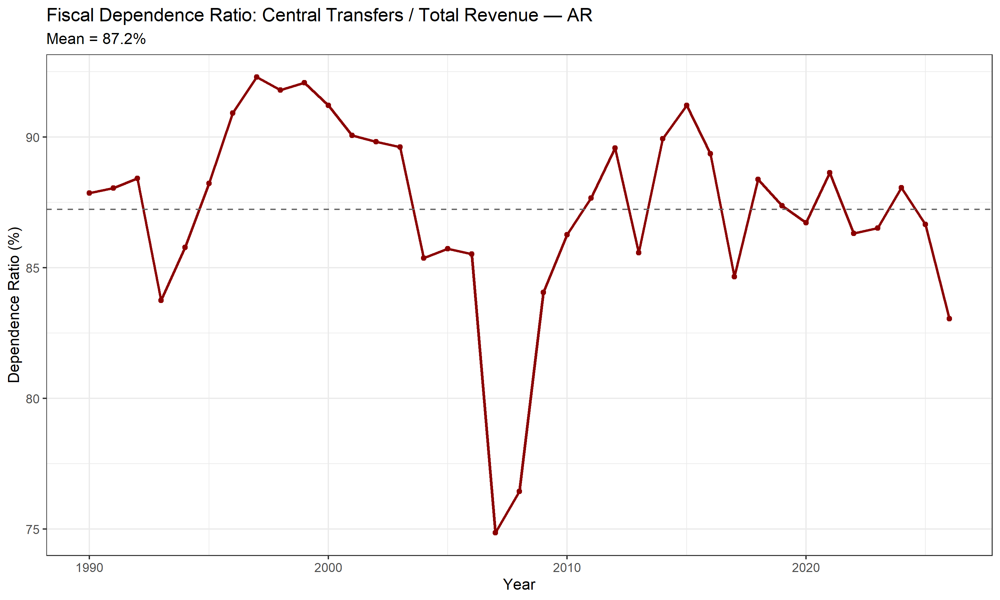

---

## 12. Project 2 Final Five-Year Fiscal Indicators

### Assignment-Final Window and Source Rule

The Project 2 table is now aligned to the assignment-final five-year window:

| Year | Figure Type | Main Source Layer |
|------|-------------|------------------|
| 2022-23 | Account | RBI State Finances database plus published current-price GSDP workbook |
| 2023-24 | Account | RBI State Finances database plus published current-price GSDP workbook |
| 2024-25 | Actual | Annual Financial Statement 2026-27 plus PRS Arunachal Pradesh Budget Analysis 2026-27 |
| 2025-26 | Revised Estimate | Budget at a Glance 2026-27 plus Annual Financial Statement 2026-27 |
| 2026-27 | Budget Estimate | Budget at a Glance 2026-27 plus Annual Financial Statement 2026-27 |

No Project 2 ratio now relies on the old notebook-only projected GSDP denominator.

### Table 7 - Fiscal Indicators, Arunachal Pradesh, 2022-23 to 2026-27

| Year | Revenue Balance / GSDP (%) | Official Fiscal Balance / GSDP (%) | Official Primary Balance / GSDP (%) | Interest / Revenue Expenditure (%) | Figure Type |
|------|---------------------------:|-----------------------------------:|------------------------------------:|-----------------------------------:|-------------|
| 2022-23 | 17.8 | -2.0 | 0.3 | 4.8 | Account |
| 2023-24 | 17.8 | 0.5 | 2.8 | 4.2 | Account |
| 2024-25 | 18.0 | 2.0 | 3.9 | 4.2 | Actual |
| 2025-26 | 16.9 | -1.6 | 0.8 | 3.6 | Revised Estimate |
| 2026-27 | 8.9 | -1.7 | 0.8 | 3.8 | Budget Estimate |

### Underlying Figures (Rs Crore)

| Year | Revenue Balance | Official Fiscal Balance | Interest Payments | Revenue Expenditure | Official GSDP |
|------|----------------:|------------------------:|------------------:|-------------------:|--------------:|
| 2022-23 | 6370.5 | -725.6 | 834.8 | 17421.8 | 35711.5 |
| 2023-24 | 6876.6 | 209.1 | 857.9 | 20561.1 | 38565.3 |
| 2024-25 | 8596.8 | 975.3 | 901.0 | 21710.1 | 47823.0 |
| 2025-26 | 6991.4 | -646.8 | 989.6 | 27133.5 | 41314.0 |
| 2026-27 | 3671.8 | -699.1 | 1017.5 | 27061.7 | 41314.0 |

**Interpretation:** The headline assignment ratios continue to look strong. Revenue balance is positive throughout the five-year window, though it falls sharply in 2026-27. Interest burden remains low at roughly 3.6 to 4.8 percent of revenue expenditure. Under the official state-budget presentation, fiscal balance oscillates around zero rather than showing chronic stress.

**The research result is the paradox, not the ratio alone:** these strong ratios coexist with extremely weak autonomous fiscal capacity. The state looks healthy on standard indicators because transfers are large relative to GSDP and because central capex loans materially affect the reported deficit concept.

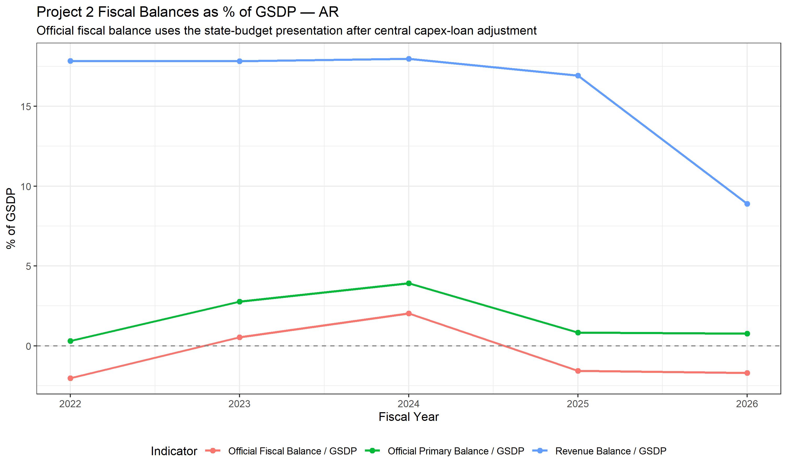

---

## 13. Extended Fiscal Analysis

### Table 8 - Recent Transfer-Dependence Snapshot

| Year | Fiscal Dependence (%) | Own Revenue / Revenue Expenditure (%) | Own Tax / Own Revenue (%) | CSS Grants (Cr) | FC Grants (Cr) |
|------|----------------------:|--------------------------------------:|--------------------------:|----------------:|---------------:|
| 2022-23 | 86.3 | 18.7 | 68.7 | 2848.2 | 210.4 |
| 2023-24 | 86.5 | 18.0 | 75.6 | 3370.6 | 220.8 |
| 2024-25 | 87.2 | 17.8 | 72.9 | 3050.6 | 408.6 |
| 2025-26 | 86.3 | 17.2 | 69.5 | 4028.0 | 644.0 |
| 2026-27 | 83.1 | 19.2 | 69.8 | 4200.0 | 359.6 |

### Revenue-Surplus Paradox, Quantified

- Revenue balance stays high at 8.9 to 18.0 percent of GSDP across the assignment-final window.
- Own revenue finances only 17.2 to 19.2 percent of revenue expenditure in the latest five years.
- Central transfers still account for 83.1 to 87.2 percent of revenue receipts.
- Average 2022-23 to 2026-27 revenue balance is 15.9 percent of GSDP, while average own revenue/revenue expenditure is only 18.2 percent.
- The low interest burden is real, but it reflects limited borrowing need in a transfer-heavy fiscal system.

The updated ratios make the core claim sharper. Arunachal Pradesh does not have a weak budget in the usual short-run sense; it has a strong headline budget resting on a weak own-resource base.

### Table 9 - Fiscal-Deficit Reconciliation

| Year | Broad Fiscal Deficit / GSDP (%) | Official Fiscal Deficit / GSDP (%) | Central Capex Loans (Cr) |
|------|--------------------------------:|-----------------------------------:|-------------------------:|
| 2024-25 | 3.1 | -2.0 balance | 2471.0 |
| 2025-26 | 10.5 | 1.6 deficit | 3703.9 |
| 2026-27 | 11.0 | 1.7 deficit | 3850.0 |

**Reconciliation note:** The official state-budget deficit and the broader PRS-style deficit are not the same measure. The gap arises because the official fiscal-rule presentation nets out central capex loans, while the broader PRS-style presentation counts them inside the effective deficit. The notebook now reports both explicitly and uses the official state-budget presentation as the assignment baseline.

### Table 10 - Committed-Expenditure Trajectory from PRS

| Year | Committed Expenditure / Revenue Receipts (%) | Salary / Revenue Receipts (%) | Pension / Revenue Receipts (%) | Interest / Revenue Receipts (%) |
|------|---------------------------------------------:|------------------------------:|-------------------------------:|--------------------------------:|
| 2024-25 A | 34.3 | 24.2 | 7.1 | 3.0 |
| 2025-26 BE | 49.1 | 38.2 | 8.1 | 2.9 |
| 2025-26 RE | 45.9 | 34.3 | 8.6 | 2.9 |
| 2026-27 BE | 60.2 | 46.4 | 10.5 | 3.3 |

**Interpretation:** The committed-expenditure snapshot reinforces the same message. Even where the official deficit is small, fiscal room is shaped by a large public wage and pension structure financed through transfers rather than by a deep own-tax base.

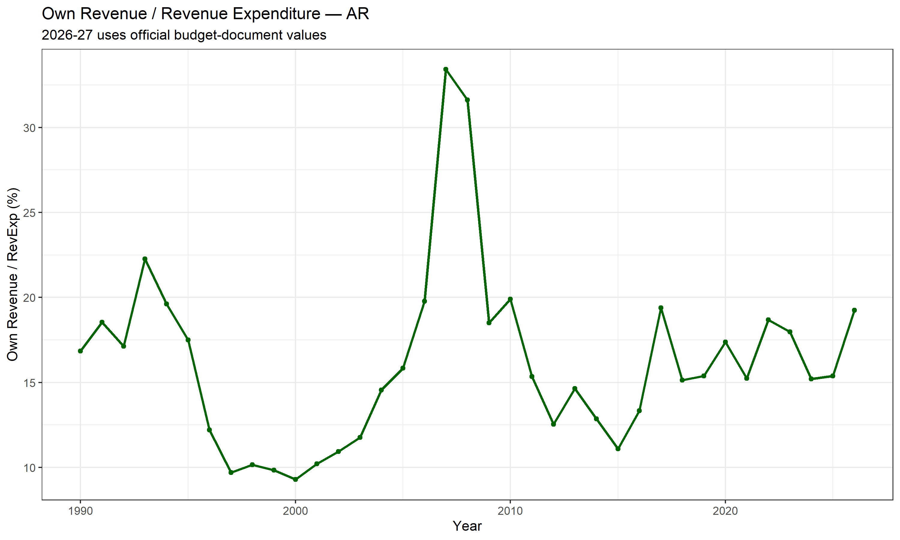

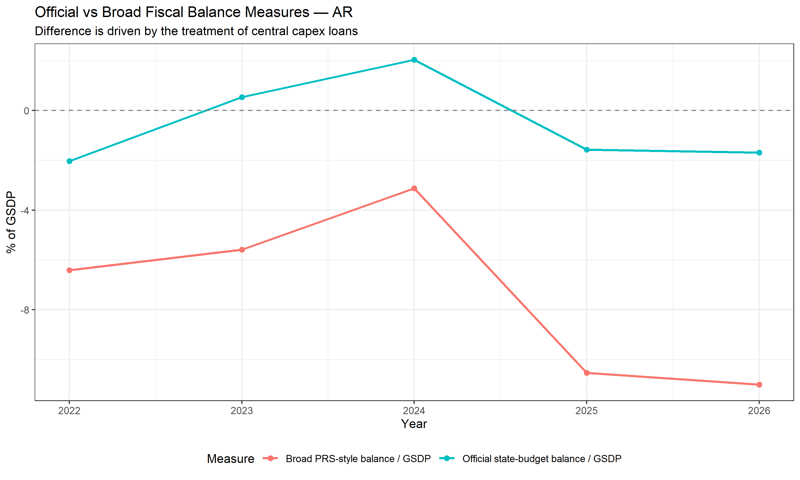

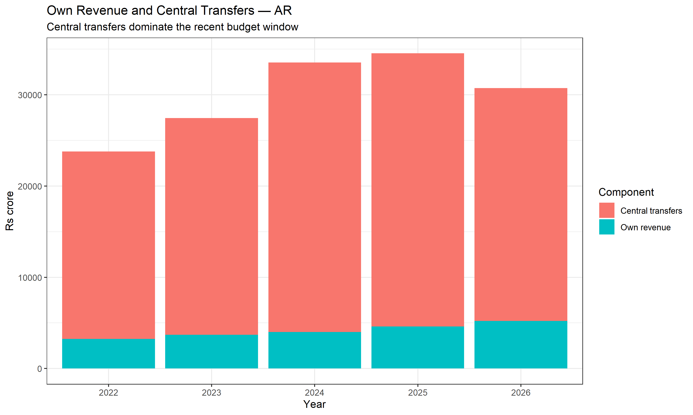

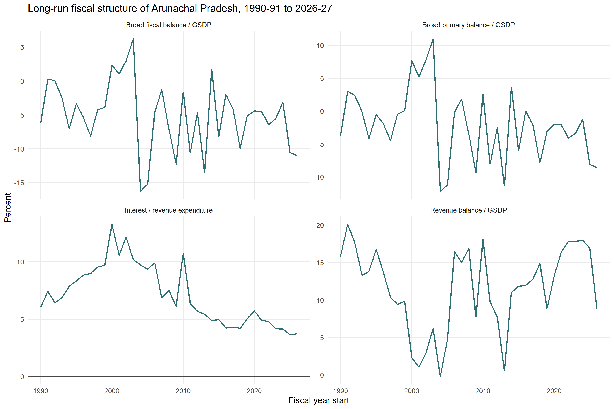

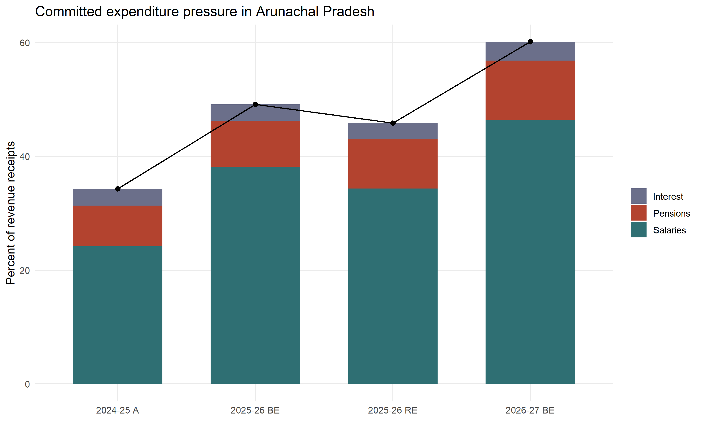

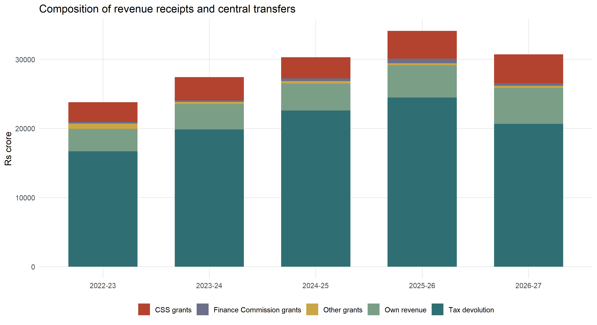

### 2026-04-29 Publishable-Paper Upgrade

The final Project 2 paper now has a substantive literature review and uses additional extension outputs:

- `tables/table27_project2_buoyancy_time_series_tests.csv` reports ADF and Engle-Granger diagnostics. ADF tests reject unit roots with deterministic trend, but Engle-Granger does not reject no cointegration at 5 percent (p about 0.098), so the own-tax buoyancy coefficient is framed as a descriptive association rather than a causal long-run equilibrium.
- `tables/table28_project2_longrun_core_indicators.csv` and `figures/fig22_project2_longrun_core_indicators.png` extend the four core fiscal indicators to 1990-91 to 2026-27.
- `tables/table29_project2_committed_expenditure_trajectory.csv` and `figures/fig23_project2_committed_expenditure_trajectory.png` add the PRS committed-expenditure path.
- `tables/table30_project2_transfer_breakdown.csv` and `figures/fig24_project2_transfer_breakdown.png` split revenue receipts into tax devolution, CSS grants, Finance Commission grants, other grants, and own revenue.
- `tables/table31_project2_16fc_transfer_trajectory.csv` and `figures/fig25_project2_16fc_transfer_trajectory.png` extend the 16th Finance Commission simulation into an illustrative 2026-31 trajectory.

---

## 14. Transfer-Growth Nexus

### Regression: GSDP growth(t+1) = alpha + beta x Transfer growth(t)

| Coefficient | Estimate | Robust SE (HC1) | t-stat | p-value |
|-------------|---------:|----------------:|-------:|--------:|
| Intercept | 5.7817 | 1.6297 | 3.55 | 0.0013 |
| Transfer growth | 0.0032 | 0.0967 | 0.03 | 0.9740 |

R^2 = 0.0001, n = 33

**Interpretation:** The transfer-growth nexus regression does not show a statistically significant short-run elasticity from transfer growth to next-year GSDP growth. That does not weaken the larger argument. The project claims a structural dependence story, not a one-year mechanical pass-through story: transfers shape the level and composition of activity even when annual fluctuations are noisy.

---

## 15. Summary of Findings

### The Paradox of Arunachal Pradesh

This research now presents a synchronized two-project narrative about Arunachal Pradesh.

**Project 1 - Growth and Inflation**

1. **Growth without deep transformation:** Arunachal Pradesh grows, but the economy does not industrialize in the standard way. Agriculture declines, services rise, and industry remains limited.
2. **Breaks do not support a simple statehood or liberalization story:** The main detected breaks are 1995-96 and 2013-14, not a clean 1987-88 or 1991 turning point.
3. **Inflation pressure remains structurally higher:** The state continues to show transport-cost and thin-market price pressure relative to the national pattern.

**Project 2 - Fiscal Health**

4. **Headline fiscal strength is real but conditional:** Revenue balance is large and interest burden is low across 2022-23 to 2026-27.
5. **Autonomous fiscal capacity is weak:** Own revenue covers only about 15 to 19 percent of revenue expenditure in the latest five-year window, while central transfers still supply more than 83 percent of revenue receipts.
6. **FRBM interpretation depends on accounting treatment:** Under the official state-budget presentation, the latest deficits are about 1.6 to 1.7 percent of GSDP. Under the broader PRS-style measure, they are about 10.5 to 11.0 percent. This difference is substantive, not cosmetic.

**The connecting thread:** Central transfers simultaneously support growth, services-heavy structural change, and headline fiscal strength. The novel contribution is to show that the same transfer-dependent structure sits behind all three outcomes.

**Current policy hook:** The 16th Finance Commission summary indicates Arunachal Pradesh's tax-devolution share falls from 1.76 under the 15th Finance Commission to 1.35 under the 16th. That makes the transfer-dependence result forward-looking, not just historical.

### Updated Data Limitations

1. AR GSDP pre-1987 is NEFA-era data.
2. AR CPI is rural-only; urban CPI is absent.
3. AR CPI combined values, where present, mirror rural values rather than representing a true combined index.
4. AR CPI has no housing item, so AR core inflation is narrower than all-India core.
5. Denton-Cholette interpolation smooths quarterly GSDP and deflator movements.
6. Project 2 now uses a hybrid source design: RBI State Finance Database is the backbone, while official 2026-27 Arunachal budget documents provide the final-year top-up and replace projected-denominator logic.
7. The official state-budget deficit and the broader PRS-style deficit are different accounting concepts and must not be collapsed into one ratio.
8. The latest three Project 2 years mix `Actual`, `Revised Estimate`, and `Budget Estimate` statuses from the 2026-27 budget cycle, so interpretation should respect those status labels.

### Figures

Current retained figure set in `figures/`:

- `fig1_log_gdp_breaks.png`
- `fig1b_india_segmentwise_vs_kinked_fit.png`
- `fig3_sectoral_shares.png`
- `fig4b_ar_segmentwise_vs_kinked_fit.png`
- `fig5_quarterly_cpi.png`
- `fig6_headline_core.png`
- `fig7_sigma_convergence.png`
- `fig8_fiscal_dependence.png`
- `fig9_fiscal_balances.png`
- `fig10_interest_ratio.png`
- `fig11_own_revenue_ratio.png`
- `fig12_comparator_real_growth_paths.png`
- `fig13_liberalisation_growth_comparison.png`
- `fig14_covid_shock_and_recovery.png`
- `fig15_cross_state_cpi_pressure.png`
- `fig16_fuel_premium_timeseries.png`
- `fig17_project2_deficit_reconciliation.png`
- `fig18_project2_revenue_composition.png`

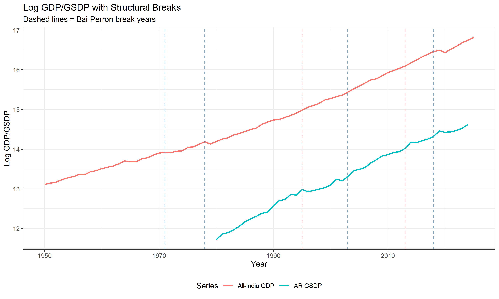

### AR CPI Data Diagnosis

A systematic audit of the Arunachal Pradesh CPI Base Year 2012 data reveals:

**Data Availability by Column:**

| Item | Rural (non-NA/total) | Urban (non-NA/total) | Combined (non-NA/total) |
|---|---|---|---|
| Food and beverages | 175/175 | 0/175 | 8/175 |
| Pan, tobacco & intoxicants | 175/175 | 0/175 | 8/175 |
| Clothing and footwear | 175/175 | 0/175 | 8/175 |
| Fuel and light | 175/175 | 0/175 | 8/175 |
| Miscellaneous | 175/175 | 0/175 | 8/175 |
| General Index (All Groups) | 178/183 | 0/183 | 10/183 |

**Key Findings:**

1. **Urban data is 100% missing** for all items across all years (2011–2025).
2. **Combined values are identical to Rural** wherever they exist — confirmed for all 6 item categories.
3. **Housing item does not exist** in AR CPI. Weights sheet shows Housing Rural = NA, Urban = 6.31.
4. **Year 2013 anomaly:** 17 rows for General Index (5 Rural NAs — duplicate entries).
5. **Year 2020 gap:** Only 10 months of data (April & May missing due to COVID-19).

**Core Inflation Methodology:**

| Method | AR | All-India |
|---|---|---|
| Approach | Inclusion (2 items, Rural only) | Inclusion (3 items, Rural+Urban) |
| Items | Clothing+footwear (6.44), Misc (24.70) | Clothing (7.36/5.57), Housing (—/21.67), Misc (27.26/29.53) |
| Coverage | Rural only | Combined (mean of Rural+Urban) |

AR core inflation is indicative but not directly comparable to All-India core due to the absence of Housing and Urban data.

### Figures

All figures saved as high-resolution PNG (300 dpi, 10×6 inches) in the `figures/` directory:

- Figure 1: Log GSDP trends with break lines
- Figure 2: Sectoral shares (stacked area)
- Figure 3: Quarterly CPI inflation
- Figure 4: Annual headline vs core inflation
- Figure 5: Inflation premium (box plots)
- Figure 6: Fiscal dependence ratio
- Figure 7: Fiscal balances as % of GSDP
- Figure 8: Capital outlay vs interest payments
- Figure 9: Own revenue / revenue expenditure
- Figure 1B: All-India continuous kinked vs segment-wise OLS fit
- Figure 4B: AR continuous kinked vs segment-wise OLS fit

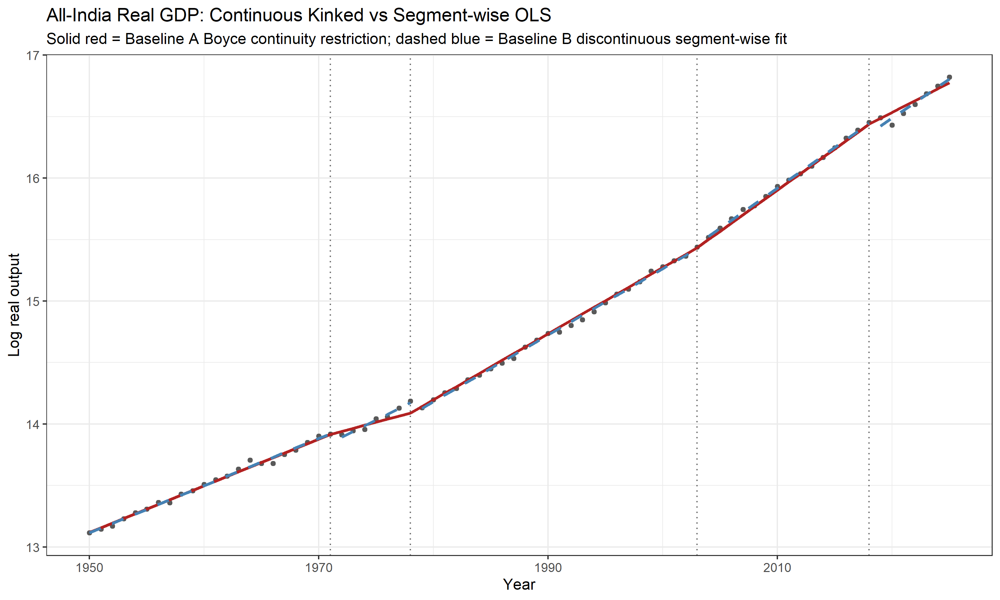
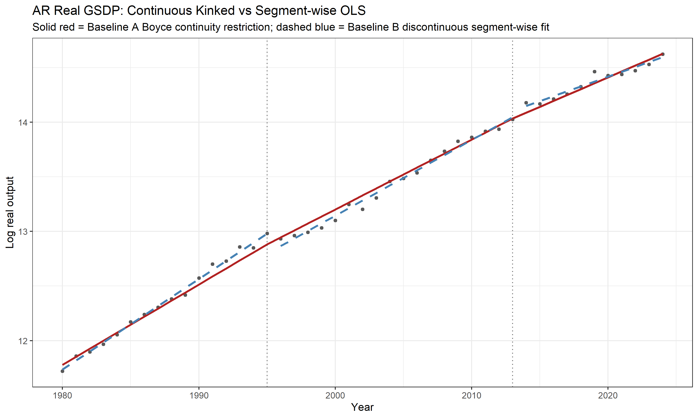

### References for Structural Break Methodology

- Bai, J. and Perron, P. (1998). "Estimating and Testing Linear Models with Multiple Structural Changes." *Econometrica*, 66(1), 47-78. https://www.econometricsociety.org/publications/econometrica/1998/01/01/estimating-and-testing-linear-models-multiple-structural
- Bai, J. and Perron, P. (2003). "Computation and Analysis of Multiple Structural Change Models." *Journal of Applied Econometrics*, 18(1), 1-22. https://doi.org/10.1002/jae.659
- Balakrishnan, P. and Parameswaran, M. (2007). "Understanding Economic Growth in India: A Prerequisite." https://www.isid.ac.in/~planning/seminar/papers/9_3_2007.pdf
- Boyce, J. K. (1986). "Kinked Exponential Models for Growth Rate Estimation." *Oxford Bulletin of Economics and Statistics*, 48(4), 385-391. https://ideas.repec.org/a/bla/obuest/v48y1986i4p385-91.html
- Hansen, B. E. (2001). "The New Econometrics of Structural Change: Dating Breaks in U.S. Labour Productivity." *Journal of Economic Perspectives*, 15(4), 117-128. https://doi.org/10.1257/jep.15.4.117
- Zeileis, A., Leisch, F., Hornik, K. and Kleiber, C. (2002). "strucchange: An R Package for Testing for Structural Change in Linear Regression Models." *Journal of Statistical Software*, 7(2). https://doi.org/10.18637/jss.v007.i02
